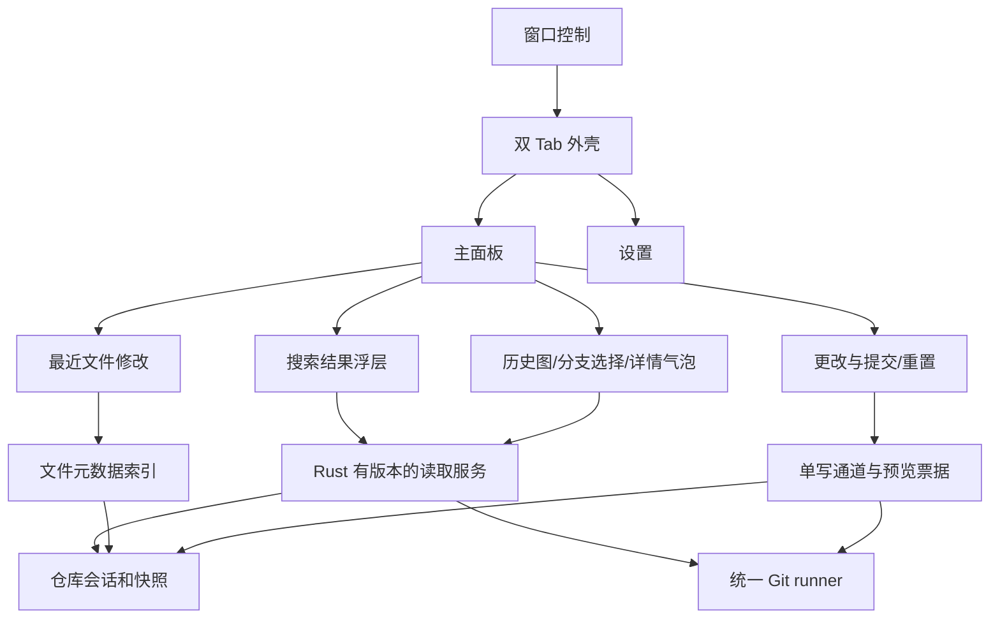

# 详细改造设计

本文规定目标方案；新增模块和接口名称是拟议名称，不表示仓库中已有实现。需求编号对应 [大纲](../OUTLINE.md)，任务顺序对应 [路线图](03-roadmap.md)。

## 1. 架构原则与模块边界

保持 Tauri 2、无框架 TypeScript、用户 Git，以及后端的三个现有边界：runner、session/model、write。改变的是 UI 组合、读取依赖和缺失的数据模型，不引入第二套 Git 实现或通用插件框架。

产品只打开并管理本机已有仓库，核心功能离线可用。应用不发起 clone/fetch/pull/push、远端配置或远端认证；submodule init/update 等可能下载对象的操作同样退出。终端进行的远程操作仍可由本地 watcher 观察其落盘结果。显示本地 remote-tracking refs 不需要网络，也不能被文案说成已同步远端。

本地 Git 读取还须阻止 partial clone 的隐式对象下载：在统一命令构造处评估并启用 Git 支持的禁止 lazy fetch 机制（如 `GIT_NO_LAZY_FETCH`），用缺对象夹具验证实际版本行为。Git 版本不支持可靠禁用时，限制该类仓库的相关读取并显示原因，不能假设设置一个未知环境变量就已禁止网络。浅克隆和缺对象状态不得伪装完整历史。

| 位置 | 职责与变化 |
| --- | --- |
| `app/src/main.ts` | 仍做装配、事件订阅与命令协调；移除所有旧视图的无差别 sync/render |
| `state.ts` | 顶级 ViewId 收敛为 main/settings；按数据域通知，保留 snapshot 单调规则与忙碌状态 |
| `shell.ts` | 两个 Tab、仓库入口、统一应用顶栏、必要状态；不持有 Git 判断 |
| 拟新增 `views/mainPanel.ts` | 组合搜索/计时/更改/历史组件，维护上下分隔和焦点恢复 |
| `views/changes.ts`、`views/history.ts` | 改为可组合区域，不再自行注册顶级页面；复用虚拟列表和几何模型 |
| 拟新增 `searchModel.ts`、`activityModel.ts` | 可由 Node 直接导入的纯展示模型；不访问 DOM，不解析 Git 命令或路径 |
| 拟新增 `search.rs`、`activity.rs`、`preferences.rs` | 分别负责元数据搜索、文件 mtime、版本化 UI 偏好；只新增确有边界的模块 |
| `history.rs`、`refs.rs` | 固定历史范围、结构化引用、拓扑和定位接口 |
| `reset.rs`、`write.rs` | 新干净重置的解析、完整预览、一次性票据及分步执行 |
| `watch.rs`、`session.rs` | 保留合并刷新；增加事件分类、有界刷新和会话失效规则 |

视图 API 提供 mount/update/dispose 或等价生命周期，取消时清除 listener、timer、ResizeObserver、浮层和过时请求。不能每次刷新重复安装事件监听。

## 2. 双 Tab 与信息架构（G01）

### 2.1 主面板

应用顶栏显示仓库入口、两个 Tab 和窗口按钮。主面板内部首行是搜索与最近修改，其下为更改区和历史图，底部保留一条必要状态。移除活动栏及六个仓库页面的路由。

420×640 逻辑像素、16px 字号作为首个设计样本，340×400 作为最小操作可达样本，同时测试 12/16/24px。上下分隔默认约 45%/55%，有最小高度；高度不足时允许面板滚动，不能挤成不可点击的图标或固定遮住提交按钮。选择、草稿和滚动不随 watcher 刷新重置。

按键采用 Ctrl/Cmd+1 主面板、+2 设置，Ctrl/Cmd+F 或 +K 聚焦统一搜索，+O 打开仓库，+R 刷新。Ctrl/Cmd+Enter 只在提交输入上下文提交；旧 +3…+7 移除并同步快捷键文档。Escape 按最上层浮层→搜索→普通页面的顺序处理。

无仓库的欢迎内容属于主面板状态。打开失败保留原因和重试；bare 仓库显示“无工作树”及可用元数据，不能因空文件数组显示工作区干净。

### 2.2 已有功能迁移

| 现有入口 | 改造后 |
| --- | --- |
| Changes | 主面板上半部；暂存、取消暂存、提交保留；Amend 不占默认提交行 |
| History | 主面板下半部；常驻详情区域改气泡/临时详情浮层 |
| Branches & Tags | 图表标签及分支选择器；创建/删除/重命名等本轮从默认入口退出 |
| Stash、Worktrees & Submodules 的本地管理 | 移除顶级导航及启动自动读取；按本地依赖保留模块，设置页不复刻管理面板 |
| Remotes、同步菜单、发布/强推、认证重试 | 删除产品入口、自动路径及对应 invoke 注册，不保留隐藏远端菜单 |
| 外部工具 | 文件行更多菜单和提交详情必要动作 |
| sequencer 冲突处理中状态 | 更改区内告知当前操作，保留外部解决与必要继续/取消路径 |
| 克隆及 submodule 下载 | 移除欢迎页、对话框、后台任务和前端命令；欢迎页只打开本地仓库 |
| 本地高级 reset | 从常驻主路径退出；保留的兼容动作按显式调用加载，不增加页面 |
| 环境诊断 | 设置的折叠次级区；开发探针转入开发构建/工具，不占外观设置主区域 |

最终清理以调用关系和实际保留入口为准。远程模块先撤销命令注册，再清理无依赖实现和测试；仍被本地动作复用的 runner、结果分类或进程清理逻辑不能连带移除。不删除用户的 remote 配置、remote-tracking refs、credential helper 或 ssh-agent 设置。发布说明明确本地范围和入口变化。

## 3. 数据域、身份与刷新（G09/G10）

### 3.1 身份协议

当前 snapshot version 保留。新增不可被前端反推为路径的 `sessionId` 或等价会话代次；每次 open/close 都变化，即使重新打开同一路径。异步读取必须绑定它。

不同数据的有效性至少如下：

| 数据 | 有效性键 | 失效动作 |
| --- | --- | --- |
| 文件列表/写操作 | sessionId + snapshotVersion | 拒绝旧 FileId；只接受新快照 |
| 历史拓扑 | sessionId + 固定 headOid + historyGeneration | 取消旧分页，清空对应游标 |
| 引用标签/分支选择器 | sessionId + refsGeneration | 只重读引用，更新原图标签 |
| 搜索 | sessionId + queryId + history/ref generation | 丢弃旧响应，取消旧扫描 |
| mtime 统计 | sessionId + activityGeneration | 仓库切换清空；旧索引不能显示到新仓库 |

这些标识由后端产生/校验，TS 只比较与携带。可把多组代次合并成读取上下文 token；不增加无用途的全局状态总线。文件快照 version 因普通保存递增，不应导致固定 HEAD 历史和已完成搜索每次全部重算。

### 3.2 有界监听

watcher 保留事件种类和相关路径到内部队列；事件只作为失效线索，最终 Git 状态仍来自 Git。工作树事件更新文件元数据并触发状态读；HEAD/refs/index 等元数据事件触发相应数据域。Git 元数据不能计入 mtime。

保留 250ms quiet debounce，新增从首事件起的最大 1s 等待目标。事件持续到来时也必须启动一次合并捕获；正在捕获时仅置 rerun 标记。实际显示延迟包括 Git 读取耗时，不能把 1s 描述成任何仓库都能达到的端到端上限。

队列有界，溢出合并为“需要重新核对”，避免把丢事件当作无变化。运行时 watcher 错误、溢出、休眠恢复均触发可见 stale 状态及重建/降级。5s polling 是现有起点，状态轮询与文件元数据核对分别调度。

忽略规则还依赖仓库之外的配置。后端记录有效 `core.excludesFile`、Git 配置来源及相关 include 文件，额外监听这些文件或其父目录；无法监听时按有界低频周期核对 metadata。只有配置来源变化后才重新解析 Git 配置并更新观察目标、重新枚举候选，不能靠常驻 Git 轮询发现变化。该依赖读取失败时活动统计进入 stale/partial，不继续声称索引完整；路径仅保存在后端。

普通计时 tick 只更新文本。只有活跃组件消费对应变更；设置页隐藏时不运行诊断，退出的高级视图不注册 snapshot listener。切 Tab 不终止后台监控，但可以停止不可见图的 DOM 重绘。

## 4. 最近文件修改时间（G04）

### 4.1 数据定义

拟议 `ActivityView` 包含：`sessionId`、`generation`、`latestModifiedAt`（可空）、`observedAt`、`state`、可选显示名和错误原因。`state` 至少区分 scanning/ready/empty/partial/stale/unavailable；计时组件不能仅根据 null 猜测原因。

Rust 使用 Git 枚举已跟踪及非忽略未跟踪路径，并处理去重、删除项、gitlink、目录边界。只读取 metadata，不读取文件内容；前端只收到格式化显示名和时间。使用原始路径字节，在 Windows 按平台路径语义处理。符号链接读取链接自身元数据，不跟随到外部；submodule 和嵌套仓库只作为边界，不递归统计其内部文件。

首次扫描可分批发布部分状态。当前候选最大 mtime 要在完整候选枚举和 stat 成功后才标为 ready；部分权限失败不得把“目前读到的最大值”宣称为全仓库最新。

### 4.2 增量与恢复

- 按路径保存 mtime 索引，使用可更新最大值的数据结构；实现先以简单 map + 最大值失效重算为起点，只有性能证据需要时再增加堆等结构。
- 创建/修改更新对应项；删除移除项；重命名移除旧项并核对新项。删除最大项后找下一个最大值，允许显示的“多久以前”变大。
- `.gitignore`、info/exclude、全局 excludes 配置、索引和 worktree 切换可改变候选集合，需要重新枚举；不把 ignored 文件频繁变动作为每次全量扫描的理由。
- 监听缺失时，分批核对 metadata 并标记结果时效；一次核对未完成不重复启动。大仓库无法在一次轮询周期内完成时保留 partial/stale，提供手动刷新。
- 暂停/最小化不伪造“没有活动”。恢复可见时重算时间差并核对索引；休眠恢复/时钟跳变标记重新校准。
- 空仓库无候选文件显示无文件修改记录；无工作树显示不可用。未来 mtime 不显示负数，说明时钟异常；时间单位在秒/分/时/天间稳定切换。

`x` 默认 5、范围 1–60 整数秒，只控制文字重算，不控制 Git freshness。打开设置调整后只维护一个计时器。计时文本不每 tick 触发 live region 播报。

## 5. 图表、引用与分支（G07）

### 5.1 历史读取

默认固定 HEAD OID、topo-order、所有父链。保留每页 50 作为起点，通过后端 opaque cursor 表达下一页和图状态。提交消息页与拓扑页均绑定同一 OID，并核对 OID/parents，失败拒绝混合绘制。

解决目前每个深页重复读取整个拓扑前缀的问题：先量化，再实现按固定历史上下文保存的增量轨道状态/检查点。上下文有内存上限和回收策略，游标失效明确告知重新加载；不能无限缓存全部提交正文。定位较旧 OID 可按需扫描位置与拓扑，在预算内渐进补齐。

浅克隆、缺失父对象和分页边界要有不同标记。完整历史不能靠首屏全部读入实现；每条父边在可用历史内可解释，继续加载不会改变已展示连接含义。

### 5.2 图和引用

复用后端轨道计算与前端 rowGeometry。建立复杂分叉、octopus merge、交叉合并及跨页 fixture；确需突破 24 轨道时扩大列标识类型并支持图区域横向滚动。代码中 `u8`/TS 限宽常量与 CSS 一并审查，不能只移除一个阈值让列号溢出。

默认不以 first-parent 代替完整图。资源边界仍可拒绝过大请求并提示；显式简化视图若保留，必须标注且不作为完整图验收证据。

引用使用结构化 `kind/name/targetOid/peeledOid`，正确区分 local branch、remote-tracking branch、轻量/附注 Tag 和 HEAD。非 commit Tag 显示目标类型，不能强行变成图节点。读取失败展示未知或重试，不能用空列表掩盖失败。标签按目标 OID 更新，不必重算不变拓扑。

### 5.3 气泡与分支选择

提交 hover 延迟建议 250ms，键盘 focus/显式详情按钮同样可触发。包含完整说明、作者、author time 与 commit time（明确名称）、完整 OID 和引用；大段说明在气泡内部滚动，使用 textContent。气泡锚定可见行，避让视口和窗口按钮；进入气泡可复制，Escape 关闭并回焦。行被虚拟化回收后气泡关闭，不指向重用 DOM 的其他提交。

分支状态按钮放图表头部；浮层只请求分支元数据。切换携带 snapshotVersion，后端拒绝脏状态冲突、锁定 worktree 等；不隐式 stash/force。切换成功更新文件、活动候选与历史上下文。detached/unborn 是独立状态，不能以空字符串冒充分支。

## 6. 统一即时搜索（G03）

### 6.1 范围与匹配

Rust 获取 Git 元数据并匹配，TS 负责输入、显示命中片段和选择。提交消息搜索遍历固定 HEAD 可达历史，包括正文；引用从整个仓库的结构化 refs 获取。作者可以作为附加命中字段，但不能替代必需字段。

字符串匹配使用一致的 Unicode 规范化和不区分大小写折叠策略，以码点/字素映射回原始展示范围。先确定 NFC/NFKC 和 case folding 的测试期望，再选择体积合理的实现或依赖。原字符串不被改写；提交号解析独立走后端对象校验，不能拿一般模糊匹配结果直接作为写入目标。

排序优先级：精确字段匹配→前缀→连续片段→有序非连续字符。再按命中紧凑程度、字段优先级、拓扑序/名称及稳定 ID 决胜。中英混合、组合重音、大小写展开、emoji 都测试；不承诺拼音检索。IME composition 期间不发半成品查询，compositionend 后立即搜索，普通输入建议约 120ms debounce。

### 6.2 查询协议与资源

拟议 `search_repository(query, context, cursor)` 返回 typed results、命中范围、queryId、范围标签、nextCursor 和完成/部分/错误状态。默认每批最多显示 50 条；扫描量、结果条数、内存分别设限，不用“50 条结果”假装搜索完毕。

每次查询更新会取消旧任务，所有 Git 读取有超时和输出上限。后台只按需扫描历史元数据，保留有界缓存；新请求可以复用同一固定历史已读元数据。长查询可持续返回候选，但扫描未完成前显示范围进度，继续操作能够覆盖余下历史。

截断输出不得解析为有效部分记录；改用更小的完整页或报告错误。单条超大说明超限同样明确报告。不能以检索已加载列表的方式满足“全历史搜索”，也不需要为此引入常驻数据库/向量索引。

### 6.3 结果动作

结果浮层有 commit/branch/tag 类型，键盘上下选择、Enter 定位或打开目标信息、Escape 关闭。当前图范围内的提交定位到原拓扑位置；范围外引用提供目标信息和明确切换本地分支操作。仅浏览 Tag 不自动 detached checkout。

搜索保持原图，使用临时高亮或滚动定位；不删除不命中行。搜索失败与空结果有不同状态，旧 query 的完成事件不能覆盖新 query 的加载状态。

## 7. 更改、提交与干净重置（G05/G06/G10）

### 7.1 文件操作和提交

复用 changes 的分组模型、FileId、stage/unstage、外部 diff/open/merge。默认可见高频操作，丢弃和清理置于有明确文案的次级动作。新增按单文件清理未跟踪项时也必须走票据，不能把 clean all 伪装成单文件放弃。

提交作用于确认提交时 Git 索引中的已暂存内容；不额外 stage。与外部 agent 并发时沿用并加强提交前重查/错误反馈，不宣称快照冻结了 Git 索引。hooks/signing 失败保留输入，成功才清空。无需为 UI 收敛改写 write lane。

### 7.2 目标解析与完整预览

新增语义命令 `preview_restore_clean(target)` / `confirm_restore_clean(nonce)`（暂定），而非前端分别发 reset 和 clean。目标只接受完整或唯一缩写的十六进制提交号；Rust 解析为当前仓库真实 commit OID，拒绝歧义、非 commit 与选项/表达式。兼容 Git 支持的 OID 长度，不在 TS 拼接命令。

预览在后端重新读取并绑定：会话、目标 OID、观察到的 HEAD、索引状态、目标树与当前树的路径差异、脏路径、所有拟清理非忽略未跟踪项，以及目标检出可能覆盖的阻挡路径。名单可分组/分页展示，但票据必须绑定完整集合；读取超限不能悄悄删减保护范围。

受影响项至少区分：目标版本变化涉及的已跟踪路径；会丢弃的本地更改；将删除的未跟踪项；提交可达性变化；本次保护的 ignored/嵌套仓库/submodule。精确性来自 Git 和原始路径，不能把展示名解析回参数。

ignored 项默认保护。若目标检出将覆盖被保护文件、嵌套仓库或不支持的 submodule 状态，则在写入前拒绝本轮操作并说明原因；不能先 hard reset 再发现已覆盖。tracked 文件即使匹配忽略规则仍按已跟踪对象处理。

### 7.3 确认、执行与结果

1. 确认先消费票据，再进入单写通道重新核对所有绑定事实。保护同一路径内容变化时，不能只比较文件名集合；结合 Git 状态/索引/目标事实与本地 metadata 指纹，必要时后端读取哈希校验，始终不向前端传内容。
2. HEAD、目标或候选变化则拒绝、刷新并要求新预览。外部 agent 的任意文件写入不受 guit 锁控制；重查只能缩小竞态窗口，不能对外宣称绝对原子安全。
3. 后端在同一写操作生命周期执行 reset 和限定范围清理。清理只作用于票据中的精确路径；使用明确参数边界与 literal pathspec，遇到目录/路径替换先拒绝，不能对后来新建的任意文件执行宽泛 clean。
4. 每一步记录是否实际执行、退出状态和取消时间。reset 已完成、clean 未完成时返回部分完成及新快照，不伪装回滚；不自动重试剩余删除步骤。
5. 最后重新检查 HEAD、索引/已跟踪差异、非忽略未跟踪及 submodule 状态。外部写入使状态再次变脏时如实报告“操作后仍有更改”。只有满足大纲定义才成功。

预览文字说明未跟踪内容删除不能依靠 reflog 恢复，HEAD 的 reflog 也不是工作区备份。UI 可提醒在重置前暂停正在写仓库的 agent；不以用户已暂停为后端免检条件。取消、拒绝、超时、部分完成沿用统一 outcome 体系扩展清楚，不把失败压成同一个 success toast。

## 8. 字体、主题 CSS 与持久化（G08）

字体设置为中文、英文、等宽三类。英文字体优先、中文回退的 UI 字体栈需要用实际拉丁/中文混排验证；等宽字段包括 OID、状态码等。允许输入已安装字体名和可选候选列表，找不到字体时显示回退，不下载远程字体。

继续使用 rem 和现有行高常量；字体替换、字号变化、系统 DPI、上下分隔调整均触发布局重新测量，更新虚拟列表几何与图线。用户主题不能无声改行高而使虚拟列表算错。

CSS 首轮支持文档化的主题子集：配色 token，以及受控组件选择器的颜色/背景/边框/字体声明。允许真正粘贴多条 CSS 规则并预览，不仅提供颜色选择器。明确拒绝网络资源、`@import`、远程字体、脚本式内容、越界选择器以及破坏布局/隐藏恢复控件的声明；按 CSS 语法解析，不能靠一组正则声称隔离完整 CSS。

建议主题预览位于受限外观容器，操作确认、窗口关闭和“禁用自定义主题”控件不受用户片段影响。应用前显示校验问题；保留上一份可用主题，提供无需当前样式即可进入的安全启动/禁用机制。不能加载仓库文件中的 CSS 或提交说明中的标签。

新增版本化偏好对象保存三类字体、字号、主题、CSS、计时和面板分隔。迁移读取旧 `guit.fontPx`/`guit.theme`，写入验证成功后才标记迁移完成；存储失败保持本次可用并说明未保存。窗口坐标和最大化状态继续由 window/session 管，不合并成含秘密的通用配置。

未来 schema 拒绝读取并原样保留；新增首次置顶默认值只在没有旧偏好时应用。CSS 长度、字体名长度、时间范围和数值有限性必须验证。

## 9. 四个窗口按钮（G02）

为保证两页右上角有一致的四按钮，采用应用自绘标题栏作为目标方向，Tauri 配置关闭重复原生装饰；先在桌面 spike 中验证 Linux/Windows/macOS 行为再迁移默认配置。若某平台达不到拖动、边框、系统菜单和辅助功能条件，保留原生装饰作为显式平台降级并在限制文档中说明，不能称该平台此目标已验收。

按钮调用原生 API：setAlwaysOnTop、minimize、maximize/unmaximize、close。关闭先进入现有 onCloseRequested 保存/清理，不能直接 destroy 绕过生命周期。必要时补 capability，按实际调用最小授权；drag region 不覆盖交互按钮，双击标题区最大化行为与按钮同步。

键盘 focus、aria-label/pressed、触控命中面积和置顶失败反馈齐全。窗口尺寸按逻辑像素管理，多屏恢复不得落到屏外；已有 settings 保存顺序与 future schema 保护保持。关闭时若有写操作，明确处理取消/完成和子进程清理，不留下看似关闭仍在无提示运行的操作。

## 10. 迁移及回退原则

实现采用小步可运行提交：先组件化和读取边界，再切导航，再逐个接真实数据。每步更新适用测试，旧 UI 相关定位需要迁移而不是删掉测试逃过门槛。

短期内部切换开关可以用于验收前对比，但最终交付不并存两套导航/两个 renderer。回退应用版本时保留新配置原文，由旧程序拒绝未来 schema；回退代码不等于自动回退用户仓库。任何已执行的 reset/clean 都只能报告事实并给出人工恢复线索。

不在本轮引入：编辑器/内嵌 diff、agent 进程管理、多仓库并行仪表盘、云同步、向量搜索、PR 平台集成或完整高级 Git 套件。遇到这类需求，单独论证，不挤占大纲交付。

远程 Git 操作当前也明确不提供；保留未来可扩展的后端结构不等于保留当前可触发网络的产品路径。hooks、签名器和用户主动打开的外部工具仍遵循用户配置，因此“guit 不主动联系远端”不能宣传成操作系统级网络沙箱。
